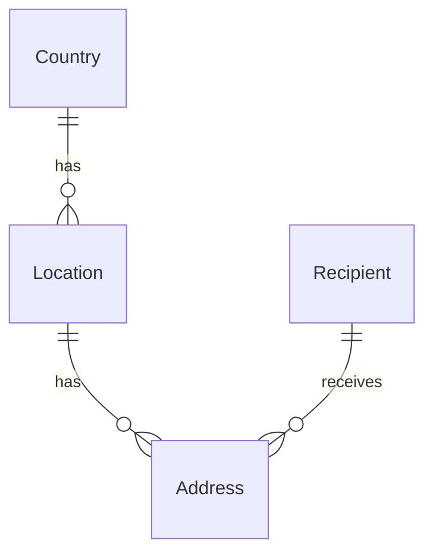

# README - Address Management System

## Summary
This is an address management platform with an ASP.NET Core Web API (.NET 10, PostgreSQL via EF Core) and an Angular client.
Addresses can be created, edited, deleted and searched by street, location and country, also on millions of rows.

## ! Installation Instructions ! 
Requirements: .NET 10 SDK (dotnet), Node.js (npm) and Docker.

Run each command from the repository root in its own terminal:
```
docker compose up -d
dotnet run --project src/AddressManagement.Api
cd src/AddressManagement.Client && npm install && npm start
```
- ! Optional test data: `dotnet run --project src/AddressManagement.Api -- SeedAddresses=100000`
- Open the app at http://localhost:4200. The Google login only works on this origin.
- Migrations are applied automatically when the API starts in Development.

- API documentation (Scalar): http://localhost:5100/scalar
- Tests: `dotnet test` (currently only one)

## Design decisions
- EF Core with Npgsql (PostgreSQL) for persistence and migrations
- FluentValidation for request validation, kept out of the controllers and entities
- Bogus for generating large amounts of test data
- Scalar for the OpenAPI documentation, openapi-typescript to generate the client types from the backend
- Angular Material and Tailwind for the UI
- xUnit and NSubstitute for unit tests

## Improvement ideas
Due to the very small timeframe, some improvement ideas and concepts could not be implemented. However,
for the improvement of the MVP, these ideas should be taken into consideration: 
### Frontend
- Creating a filter dialogue which first selects the country in which you want to filter,
then a multi select for cities, and only when the cities are selected you search for particular addresses.
This way, the database doesn't have to search potentially millions of addresses, but only those of the selected cities
and at the same time improve UI/UX experience. 
-  Also, a multiselect for cities instead of countries would make more sense.
### Backend
- Filtering by a location with very few addresses (e.g. a newly created one) 
combined with sorting by street can be slow on millions of rows. 
Based on my research, Postgres overestimates the matches and walks the street index. 
A potential fix (for the current use case model) would resolve the location ids first and filter by LocationId.
- Fields should have individual maximum lengths instead of one shared limit.
- The validation rules (e.g. zip codes per country) need to be thought through in more detail, ideally an external
validation service (e.g. via google) could be used to validate the addresses and warn if they couldnt be found.
The countries could be saved in a ISO-conform way with abbreviations like "DE", "AT" so that there are no country names
in different languages.
- The Google Auth authenticates but doesnt authorize in varying ways (there are not multiple roles like a
user who can only read and an admin user who can modify the data). For a production system, this has to be 
changed.
- Of course, 

## Architecture
- `AddressManagement.Domain`: entities
- `AddressManagement.Application`: DTOs, services, validators and repository interfaces
- `AddressManagement.Infrastructure`: EF Core DbContext, repositories, migrations and the dev data seeder
- `AddressManagement.Api`: controllers, authentication (Google ID token) and error handling
- `AddressManagement.Client`: Angular frontend
- The tables live in their own database schema (`addresses`), so further modules can add their own schema.

## Entities

Note: The `Recipient` entity could later be used for an invoice module addition (as listed as a potential upgrade
in the future)

## Applied Database Optimizations
- Use of indexes on columns such as "Street", "Location.Name", ... for efficient sorting and filtering
- Normalization of data in four entities (Address, Location, Country and Recipient) to prevent duplicate data.
- Use of "pg_trgm"-extension for efficient string pattern matching (applied for "Street")
- Use of "citext"-extension for case-insensitive checking of duplicates (so that there cant be "Österreich" and "ÖSTErreich")
- Use of projections `(SELECT ...)` instead of querying whole entries

## Additional notes
- Frontend uses autogenerated models from Backend via the OpenApi-Configration. 
When updating the models, run the script `npm run api:types` to apply the changes to the frontend automatically
- A select option for rows was added which was technically not a listed could-have, but the <mat-table> Materials template
made it relatively easy to integrate so I couldn't resist it.
- In dev mode, SQL requests which take long are logged so that you can debug them. 